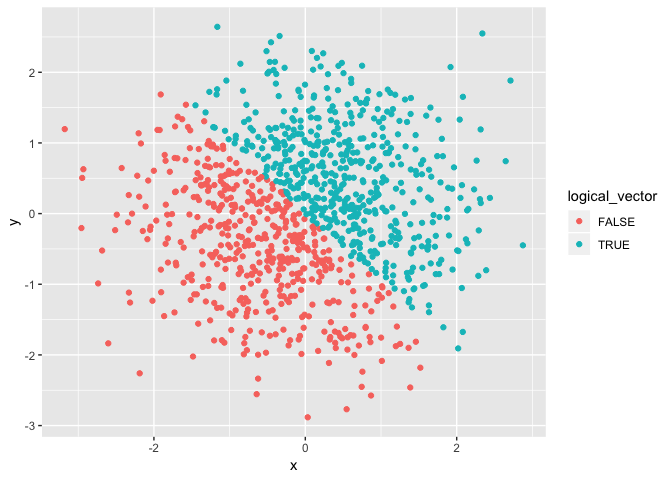

Homework 1
================
Amin Yakubu
09-15-2018

Problem 1
---------

This chunk loads the tidyverse package and creates a data frame with 4 variables: random\_num, vec\_logical, vec\_char and vec\_factor.

``` r
library(tidyverse)
```

    ## ── Attaching packages ──────────────────────────────────────────────────────────────────── tidyverse 1.2.1 ──

    ## ✔ ggplot2 3.0.0     ✔ purrr   0.2.5
    ## ✔ tibble  1.4.2     ✔ dplyr   0.7.6
    ## ✔ tidyr   0.8.1     ✔ stringr 1.3.1
    ## ✔ readr   1.1.1     ✔ forcats 0.3.0

    ## ── Conflicts ─────────────────────────────────────────────────────────────────────── tidyverse_conflicts() ──
    ## ✖ dplyr::filter() masks stats::filter()
    ## ✖ dplyr::lag()    masks stats::lag()

``` r
set.seed(757)

sample_df = tibble(
  random_num = runif(10, min = 0, max = 5),
  vec_logical = random_num > 2,
  vec_char = c("apple", "banana", "cabbage", "grapefruit", "lettuce", "apricot", "lemons", "lychees", "kiwifruit", "pomegranate"),
  vec_factor = factor(c("fruit", "fruit", "vegetable", "fruit", "vegetable", "fruit", "fruit", "fruit", "fruit", "fruit"))
)
```

### Taking means

Here, we will try to take means of number variable, random\_num, and of logical vector, vec\_logical.

``` r
mean(sample_df$random_num)
```

    ## [1] 2.78474

``` r
mean(sample_df$vec_logical)
```

    ## [1] 0.7

We see it it possible to take the mean of number and logical variables as shown in the output.

Next, we will try to take the mean of a character vector.

``` r
mean(sample_df$vec_char)
```

    ## Warning in mean.default(sample_df$vec_char): argument is not numeric or
    ## logical: returning NA

    ## [1] NA

We see an output saying NA which means not available with a warning message. This is because we cannot calculate the means of character strings.

``` r
mean(sample_df$vec_factor)
```

    ## Warning in mean.default(sample_df$vec_factor): argument is not numeric or
    ## logical: returning NA

    ## [1] NA

We also get an output saying NA which means not available with a warning message as well. This also is because we cannot calculate the means of factor strings.

### Variable conversions 1

``` r
new_vec_logical = as.numeric(sample_df$vec_logical)

new_vec_char = as.numeric(sample_df$vec_char)
```

    ## Warning: NAs introduced by coercion

``` r
new_vec_factor = as.numeric(sample_df$vec_factor)
```

Conversion of logical variable to numeric is possible. The values of TRUE are coded 1 and FALSE are coded 0.

However, conversion of character variables doesn't work properly as we will expect. The character variables are coerced and replaced with NA (not available). There is a warning message saying "NAs are introduced because by coercion".

On the other hand, factor variables are properly converted into numeric. R assigns numeric values to the factors in alphabetical order. Thefore, in our case fruit is assigned a value of 1 and vegetable is assigned 2.

### Conversion of character variable from character to factor to numeric

``` r
char_to_fact_to_num = as.numeric(as.factor(sample_df$vec_char))

fact_to_char = as.character(sample_df$vec_factor)
char_to_numeric = as.numeric(fact_to_char)
```

    ## Warning: NAs introduced by coercion

We see that it is possible to convert from character to factor then to numeric. R assigns numbers to the factors in alphabetical order.

Although, it is possible to convert factor to character, attempts to convert character to numeric introduces NAs by coercion.

Problem 2
---------

### Creating a data frame with 5 variables

``` r
set.seed(339)

random_sample = tibble(
  x = rnorm(1000),
  y = rnorm(1000),
  logical_vector = x + y > 0,
  numeric_vector = as.numeric(logical_vector),
  factor_vector = as.factor(logical_vector)
)
```

We have a dataset size of 1000. Variable x has a mean of -0.0133766 and a median value of -0.0246937. The proportion of cases for which the logical vector is TRUE is 0.522.

### Scatter plots

``` r
library(ggplot2)

scatter_plot1 = ggplot(random_sample, aes(x = x, y = y, color = logical_vector)) + geom_point()
scatter_plot1
```



``` r
scatter_plot2 = ggplot(random_sample, aes(x = x, y = y, color = numeric_vector)) + geom_point()
scatter_plot2
```


``` r
scatter_plot3 = ggplot(random_sample, aes(x = x, y = y, color = factor_vector)) + geom_point()
scatter_plot3
```


``` r
ggsave("scatter_plot1.pdf", plot = scatter_plot1, height = 4, width = 6)
```

We see that when we color by variables, R assigns the same color to the same values of the variable for factor and logical variables. For example, for scatter\_plot1, FALSE is assigned one color and TRUE is assigned another. For numeric variables, R uses a heat map color style. The color grade changes gradually within a range of the values, in this case 0 to 1. However, we see just 2 colors because we have just 0 or 1.
